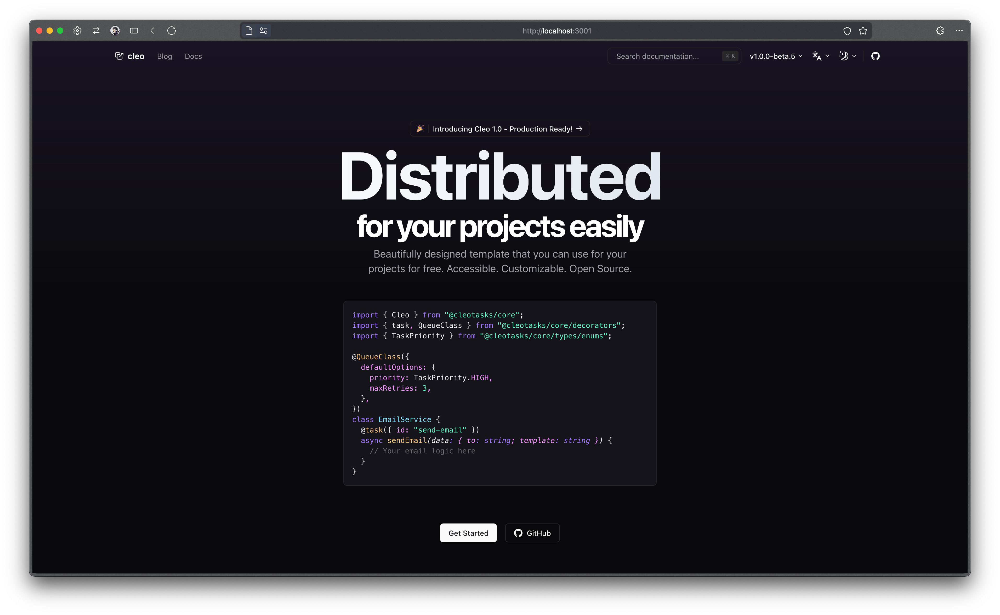
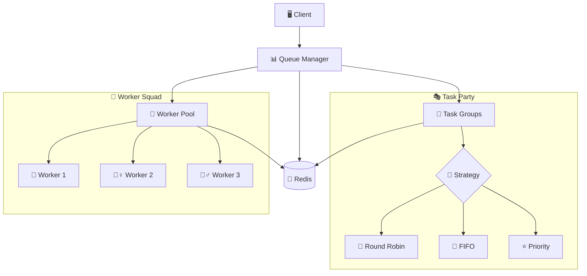
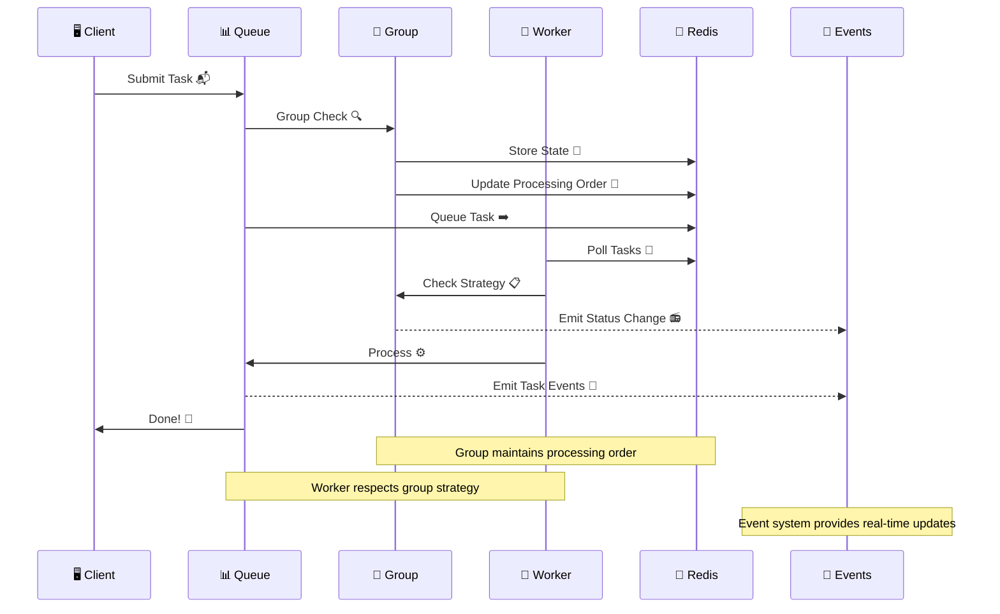
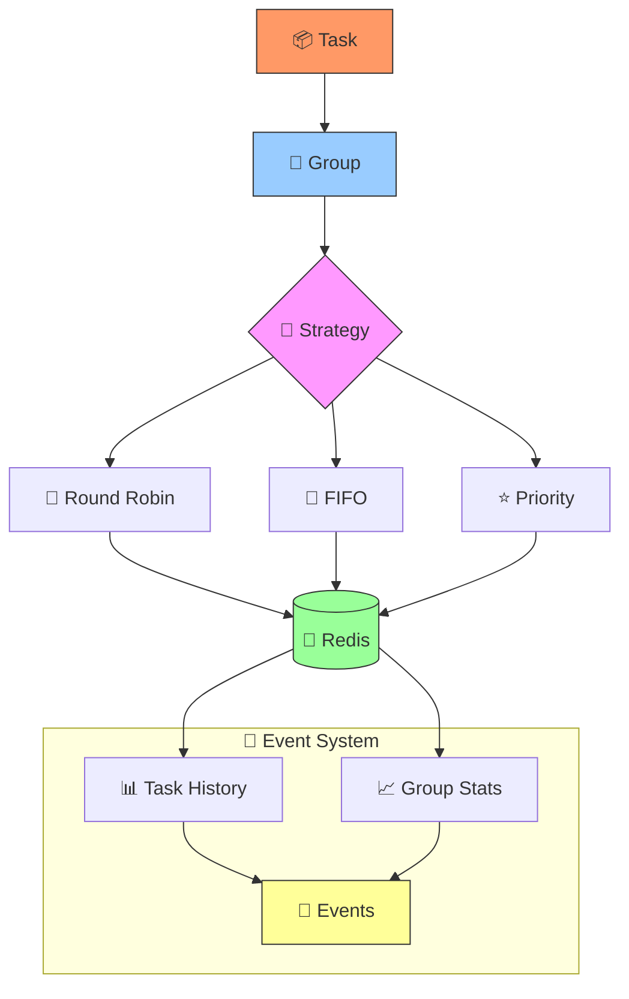
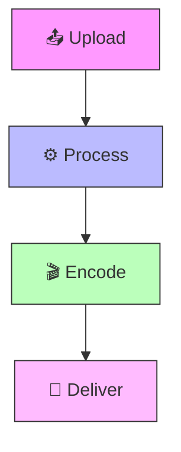
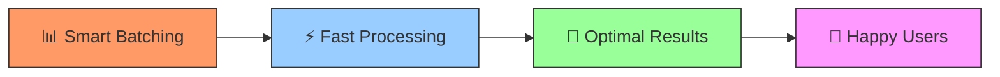

# Cleo 🚀


> Why did the task queue go to therapy? It had too many unresolved promises! 😅

A distributed task queue system that's seriously powerful (but doesn't take itself too seriously 🎭).



## Docs

- [Cleo Docs](https://cleo.theboring.name)

## Features ✨

- **Enhanced Task Grouping** 🎯 - Smart task coordination with multiple processing strategies
- **Intelligent Task Decorators** 🎀 - Auto-filtering events and lifecycle management
- **Distributed Locking** 🔐 - No queue jumping allowed!
- **Advanced Retry with Backoff** 🔄 - Smart retries with configurable strategies
- **Redis-Backed** 📦 - Because memory is fleeting, but Redis is forever
- **TypeScript Support** 💪 - For when `any` just won't cut it
- **Real-time Event System** 📡 - Keep track of your tasks with detailed events
- **Task History & Analytics** 📊 - Complete visibility into task lifecycles

### Core Superpowers 💫

#### Task Processing 🎯
- 🚀 Distributed processing with auto load balancing
- 🎭 Smart group task management with multiple strategies
- 📊 Enhanced real-time monitoring with filtered events
- ⭐ Dynamic priority-based processing
- ⚡ Event-driven architecture with detailed task history
- 🛡️ Robust error handling and retry mechanisms
- 📈 Comprehensive performance metrics and analytics

#### Group Processing Strategies 🎲
- 🔄 **Round Robin**: Fair distribution with last-processed time tracking
- 📝 **FIFO**: Strict order processing with complete task history
- ⭐ **Priority**: Dynamic priority adjustment with group statistics
- 🎯 **Smart Processing**: Adapts to task patterns and system load

#### Advanced Features 🔬
- 🎯 **Smart Batching**
  - Groups tasks like a pro party planner
  - Optimizes performance like a caffeine-powered compiler
  - Handles bursts better than your morning coffee machine

- 📊 **Real-time Analytics**
  - Success/failure tracking (keeping score)
  - Processing time stats (for the speed demons)
  - Resource usage metrics (watching the diet)
  - Performance insights (big brain time)

#### Security & Protection 🛡️
- 🔐 Redis ACL support (because sharing isn't always caring)
- 🎯 Task-level permissions (not everyone gets a backstage pass)
- 📝 Audit logging (tracking who did what)
- 🔑 Role-based access (VIP list management)

## System Architecture 🏗️
(Where all the magic happens ✨)


## Task Flow 🌊
(AKA: The Epic Journey of a Task)



## Task Group Processing 🎭
(How tasks play nice together)



## Real-World Examples 🌍
(Because who doesn't love practical examples?)

### Video Processing 🎥


## Installation 🛠️

```bash
npm install @cleo/core
# or if you're yarn-core'd
yarn add @cleo/core
```

## Quick Start 🏃‍♂️

## Examples 🎮
(Because the best way to learn is by doing!)

### Quick Start 🚀
```typescript
import { Cleo } from '@cleo/core';

// Get your Cleo instance (it's like a task-managing pet)
const cleo = Cleo.getInstance();

// Configure it (give it treats and training)
cleo.configure({
  redis: {
    host: "localhost",
    port: 6379,
    password: "cleosecret",
  },
  worker: {
    concurrency: 4,
    queues: [
      {
        name: "send-email",
        priority: TaskPriority.HIGH,
      },
    ],
  },
});

// Monitor your tasks (helicopter parenting, but for code)
const queueManager = cleo.getQueueManager();
queueManager.onTaskEvent(ObserverEvent.STATUS_CHANGE, (taskId, status, data) => {
  console.log(`Task ${taskId} status changed to ${status}`, data);
});
```

### Task Decorators 🎀
```typescript
import { task } from "@cleo/core";

class EmailService {
  @task({
    id: "send-email",
    priority: TaskPriority.HIGH,
    queue: 'send-email',
    group: 'notifications',
    timeout: 30000,
    maxRetries: 3,
    retryDelay: 3000,
  })
  async sendEmail(input: { email: string }): Promise<string> {
    // Your email sending logic here
    return `Sent to ${input.email}`;
  }
}

// Task decorator automatically:
// - Filters task events by taskId
// - Manages task lifecycle within groups
// - Handles cancellation through AbortSignal
// - Provides automatic cleanup of event listeners
```

### Advanced Group Processing 🎭
```typescript
import { QueueClass, GroupProcessingStrategy } from "@cleo/core";

// Define a service with group settings
@QueueClass({
  defaultOptions: {
    maxRetries: 3,
    retryDelay: 1000,
    backoff: {
      type: "fixed",
      delay: 2000,
    },
    group: "notifications",
    timeout: 300000,
  },
  queue: "notifications",
})
class NotificationService {
  async sendPushNotification(data: { message: string }) {
    console.log(`📱 Sending push: ${data.message}`);
    return `Notification sent: ${data.message}`;
  }

  async sendSMS(data: { message: string }) {
    console.log(`📲 Sending SMS: ${data.message}`);
    return `SMS sent: ${data.message}`;
  }
}

// Enhanced Group Processing Features
const queueManager = cleo.getQueueManager();

// Round Robin - Fair distribution with last-processed time tracking
queueManager.setGroupProcessingStrategy(GroupProcessingStrategy.ROUND_ROBIN);

// FIFO - Strict order processing with task history
queueManager.setGroupProcessingStrategy(GroupProcessingStrategy.FIFO);

// Priority - Dynamic priority adjustment with group stats
queueManager.setGroupProcessingStrategy(GroupProcessingStrategy.PRIORITY);
await queueManager.setGroupPriority("notifications", 10);

// New: Group Task Event Handling
queueManager.onTaskEvent(ObserverEvent.GROUP_CHANGE, (taskId, status, data) => {
  // Enhanced group event data including:
  // - Task history
  // - Group processing stats
  // - Task completion/failure details
  console.log(`👥 Group operation for ${taskId}:`, {
    operation: data.operation,
    group: data.group,
    history: data.history
  });
});
```

### Error Handling & Retries 🛟
```typescript
// Built-in retry configuration
@QueueClass({
  defaultOptions: {
    maxRetries: 3,
    backoff: {
      type: "fixed",
      delay: 2000,
    },
    retryDelay: 1000,
  }
})
class ReliableService {
  async mightFail() {
    // Will retry 3 times with backoff
    throw new Error("Oops!");
  }
}

// Manual retry with backoff
import { RetryWithBackoff } from "@cleo/core";

const result = await retryWithBackoff(
  async () => {
    return await unreliableOperation();
  },
  3,    // max retries
  1000  // base delay in ms
);
```

### Event Monitoring 📊
```typescript
const queueManager = cleo.getQueueManager();

// Monitor all the things!
queueManager.onTaskEvent(ObserverEvent.STATUS_CHANGE, (taskId, status, data) => {
  console.log(`💬 Task ${taskId} status: ${status}`);
});

queueManager.onTaskEvent(ObserverEvent.GROUP_CHANGE, (taskId, status, data) => {
  console.log(`👥 Group operation: ${data.operation}`);
});

queueManager.onTaskEvent(ObserverEvent.TASK_COMPLETED, (taskId, status, result) => {
  console.log(`✅ Task ${taskId} completed:`, result);
});

queueManager.onTaskEvent(ObserverEvent.TASK_FAILED, (taskId, status, error) => {
  console.log(`❌ Task ${taskId} failed:`, error);
});
```

### Complete Examples 📚

Check out our example files for full implementations:
- [Basic Usage](packages/core/examples/basic.ts) - Simple task processing with monitoring
- [Advanced Features](packages/core/examples/advanced.ts) - Group processing, strategies, and error handling

Each example comes with:
- 🎯 Complete setup and configuration
- 📊 Event monitoring setup
- 🎭 Different processing strategies
- 🛠️ Error handling patterns
- 📈 Performance monitoring

## Contributing 🤝

We welcome contributions! Whether you're fixing bugs 🐛, adding features ✨, or improving docs 📚, we'd love your help!

> Q: How many developers does it take to review a PR?
> A: None, they're all stuck in an infinite loop of bikeshedding! 😄

Check out our [Contributing Guidelines](CONTRIBUTING.md) for:
- Code style and standards 📝
- Development workflow 🔄
- Project structure 🏗️
- Pull request process 🔍
- Bug reporting guidelines 🐞

### Key Components 🔧

Our project is like a well-oiled machine (that occasionally needs coffee):
- **QueueManager** 📊 - The traffic controller of your tasks
- **TaskGroup** 👥 - Because tasks work better in teams
- **Worker** 🏃 - The real MVP doing all the heavy lifting
- **Utilities** 🛠️ - Our Swiss Army knife of helper functions

## Performance Features ⚡
(Because speed matters!)



## License 📜

MIT License - see LICENSE file for details

> Remember: In a world of callbacks, promises, and async/await, we're all just trying our best to avoid race conditions! 🏁

---
Made with ❤️ and probably too much caffeine ☕
