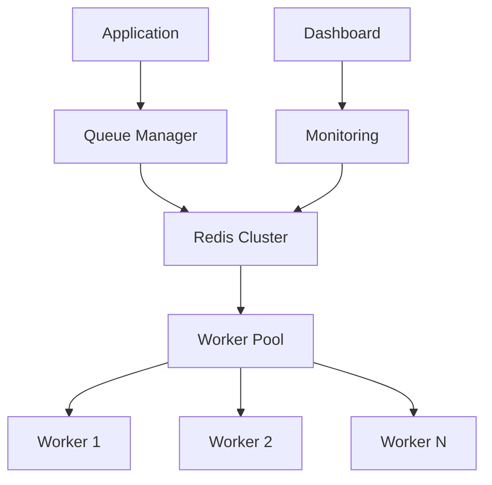

# 📈 Advanced Scaling Patterns with Cleo

As your task processing needs grow, understanding how to effectively scale Cleo becomes crucial. This guide explores proven patterns and strategies for scaling Cleo in production environments.

## 🏗️ Architecture Overview

Before diving into scaling patterns, let's understand Cleo's distributed architecture:



## 🔄 Worker Scaling Strategies

### Dynamic Concurrency

```typescript
cleo.configure({
  worker: {
    // Base configuration
    concurrency: Math.max(1, os.cpus().length - 1),
    maxMemoryUsage: 1024 * 1024 * 512, // 512MB
    
    // Queue-specific settings
    queues: [
      {
        name: "cpu-intensive",
        concurrency: 2,
        priority: TaskPriority.HIGH
      },
      {
        name: "io-bound",
        concurrency: 10,
        priority: TaskPriority.NORMAL
      }
    ]
  }
});
```

### Intelligent Load Distribution

```typescript
// Implement custom load balancing
class SmartLoadBalancer {
  async distribute(task: Task): Promise<string> {
    const workers = await queueManager.getAllWorkers();
    const metrics = await Promise.all(
      workers.map(w => w.getMetrics())
    );
    
    return this.selectOptimalWorker(workers, metrics, task);
  }

  private selectOptimalWorker(workers: Worker[], metrics: WorkerMetrics[], task: Task): string {
    // Consider:
    // - Current worker load
    // - Task priority and weight
    // - Worker performance history
    // - Resource utilization
    return workers[optimalIndex].id;
  }
}
```

## 📊 Group Processing at Scale

### Priority-based Processing

```typescript
// Configure group processing strategy
queueManager.setGroupProcessingStrategy(GroupProcessingStrategy.PRIORITY);

// Set dynamic priorities
async function adjustGroupPriorities() {
  const groups = await queueManager.getAllGroups();
  for (const group of groups) {
    const stats = await group.getStats();
    const priority = calculatePriority(stats);
    await queueManager.setGroupPriority(group.name, priority);
  }
}
```

### Rate Limiting

```typescript
// Configure rate limits per group
const group = await queueManager.getGroup("api-calls");
await group.updateConfig({
  rateLimit: {
    max: 1000,
    duration: 60000 // 1000 tasks per minute
  },
  concurrency: 5,
  maxConcurrency: 10
});
```

## 🔋 Redis Optimization

### Clustering Configuration

```typescript
cleo.configure({
  redis: {
    // Cluster configuration
    cluster: [
      {
        host: "redis-1.example.com",
        port: 6379
      },
      {
        host: "redis-2.example.com",
        port: 6379
      }
    ],
    // Performance settings
    maxRetriesPerRequest: 3,
    enableReadyCheck: false,
    connectTimeout: 10000,
    // Multi-tenant support
    keyPrefix: "tenant1:",
  }
});
```

### Data Persistence

```typescript
// Configure Redis persistence
redis.config("SET", "save", "900 1 300 10 60 10000");
redis.config("SET", "appendonly", "yes");
redis.config("SET", "appendfsync", "everysec");
```

## 📈 Monitoring at Scale

### Comprehensive Metrics

```typescript
// Worker monitoring
const worker = cleo.getWorker("high-priority");
const metrics = await worker.getMetrics();

// Track key performance indicators
console.log({
  throughput: metrics.tasksProcessed / metrics.uptime,
  successRate: metrics.tasksSucceeded / metrics.tasksProcessed,
  averageLatency: metrics.averageProcessingTime,
  memoryUsage: process.memoryUsage().heapUsed
});

// Group monitoring
const group = await queueManager.getGroup("critical-tasks");
const stats = await group.getStats();
const history = await group.getHistory();

// Queue monitoring
const queueMetrics = await queueManager.getQueueMetrics("default");
```

### Health Checks

```typescript
// Implement comprehensive health checks
class HealthMonitor {
  async checkHealth(): Promise<HealthStatus> {
    const redisStatus = await this.checkRedis();
    const workerStatus = await this.checkWorkers();
    const queueStatus = await this.checkQueues();
    
    return {
      healthy: redisStatus.healthy && workerStatus.healthy && queueStatus.healthy,
      metrics: {
        redis: redisStatus.metrics,
        workers: workerStatus.metrics,
        queues: queueStatus.metrics
      }
    };
  }
}
```

## 🚀 Auto-scaling

### Worker Auto-scaling

```typescript
class WorkerScaler {
  async scale() {
    const metrics = await this.getSystemMetrics();
    
    if (this.shouldScale(metrics)) {
      const workerCount = this.calculateOptimalWorkers(metrics);
      await this.adjustWorkerPool(workerCount);
    }
  }

  private shouldScale(metrics: SystemMetrics): boolean {
    return (
      metrics.queueLength > this.thresholds.maxQueueLength ||
      metrics.averageLatency > this.thresholds.maxLatency ||
      metrics.cpuUsage > this.thresholds.maxCpuUsage
    );
  }
}
```

### Queue Auto-scaling

```typescript
// Dynamic queue configuration
class QueueScaler {
  async adjustQueueSettings(queueName: string) {
    const metrics = await queueManager.getQueueMetrics(queueName);
    const newConcurrency = this.calculateOptimalConcurrency(metrics);
    
    await this.updateQueueConfig(queueName, {
      concurrency: newConcurrency,
      rateLimit: this.calculateRateLimit(metrics)
    });
  }
}
```

## 🔐 Security at Scale

### Multi-tenant Isolation

```typescript
// Configure tenant isolation
class TenantManager {
  getTenantInstance(tenantId: string): Cleo {
    return Cleo.getInstance(tenantId).configure({
      redis: {
        keyPrefix: `tenant:${tenantId}:`,
        db: this.getTenantDb(tenantId)
      },
      worker: this.getTenantWorkerConfig(tenantId)
    });
  }
}
```

### Rate Limiting per Tenant

```typescript
class TenantRateLimiter {
  async enforceRateLimits(tenantId: string, task: Task): Promise<boolean> {
    const limits = await this.getTenantLimits(tenantId);
    const usage = await this.getTenantUsage(tenantId);
    
    return this.checkLimits(usage, limits);
  }
}
```

## 📋 Production Checklist

- [ ] Configure worker concurrency based on CPU cores and task types
- [ ] Implement intelligent load balancing
- [ ] Set up Redis clustering with appropriate persistence
- [ ] Configure comprehensive monitoring and alerting
- [ ] Implement auto-scaling based on metrics
- [ ] Set up multi-tenant isolation
- [ ] Configure rate limiting at multiple levels
- [ ] Implement graceful shutdown procedures
- [ ] Set up backup and recovery procedures
- [ ] Monitor and optimize Redis performance

For more detailed information about scaling Cleo, check out our other guides:
- [Scaling Guide](../docs/scaling)
- [Best Practices](../docs/best-practices)
- [API Reference](../docs/api-reference) 