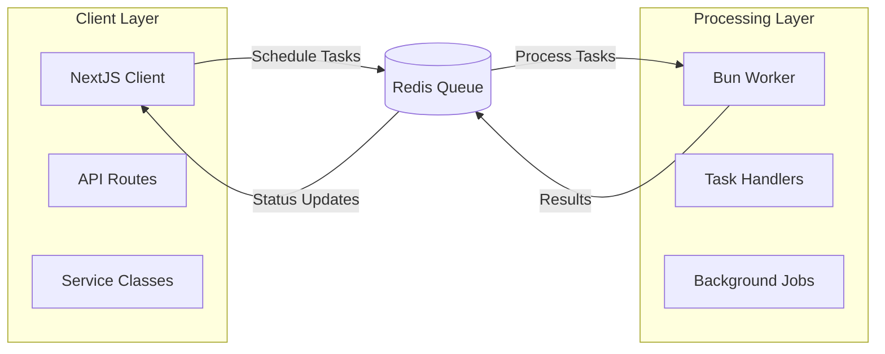

# 🏗️ Client-Server Integration Guide

Cleo v1.0.9 introduces a robust client-server architecture that separates task scheduling from task processing. This guide shows you how to implement distributed task processing using NextJS for clients and Bun for workers.

## 🎯 Architecture Overview



## 🔄 Key Concepts

### Client Mode
- **Purpose**: Schedule and queue tasks
- **Environment**: NextJS applications, API routes, web services
- **Responsibilities**: Task creation, status monitoring, result retrieval
- **No Processing**: Tasks are queued but not executed locally

### Worker Mode
- **Purpose**: Process tasks from queues
- **Environment**: Bun runtime, background services, separate processes
- **Responsibilities**: Task execution, error handling, result publishing
- **Scalable**: Multiple workers can process the same queues

## 📱 NextJS Client Implementation

### Basic Client Setup

```typescript
// lib/cleo-client.ts
import { CleoClient } from "@cleotasks/core";

const cleo = CleoClient.getInstance();

export async function initializeCleo() {
  await cleo.configure({
    redis: {
      host: process.env.REDIS_HOST || "localhost",
      port: parseInt(process.env.REDIS_PORT || "6379"),
      password: process.env.REDIS_PASSWORD,
    },
  });
  
  return cleo;
}

export { cleo };
```

### Service Classes with Task Decorators

```typescript
// services/email.service.ts
import { task } from "@cleotasks/core";
import { TaskPriority } from "@cleotasks/core";

export class EmailService {
  @task({
    priority: TaskPriority.HIGH,
    queue: "email",
    group: "notifications",
    timeout: 30000,
    maxRetries: 3,
  })
  async sendWelcomeEmail(userId: string, email: string): Promise<void> {
    // This method will be queued, not executed immediately
    console.log(`Queuing welcome email for ${email}`);
    
    // The actual email sending happens in the worker
    // This just schedules the task
  }

  @task({
    priority: TaskPriority.MEDIUM,
    queue: "email",
    group: "notifications",
    timeout: 60000,
  })
  async sendPasswordResetEmail(email: string, resetToken: string): Promise<void> {
    console.log(`Queuing password reset email for ${email}`);
  }
}
```

### API Route Implementation

```typescript
// app/api/emails/route.ts
import { EmailService } from "@/services/email.service";
import { initializeCleo } from "@/lib/cleo-client";

// Initialize Cleo client
await initializeCleo();

export async function POST(request: Request) {
  try {
    const { action, userId, email, resetToken } = await request.json();
    
    const emailService = new EmailService();
    
    switch (action) {
      case "send-welcome":
        // This queues the task - returns immediately
        await emailService.sendWelcomeEmail(userId, email);
        return Response.json({ 
          success: true, 
          message: "Welcome email queued successfully" 
        });
        
      case "send-password-reset":
        await emailService.sendPasswordResetEmail(email, resetToken);
        return Response.json({ 
          success: true, 
          message: "Password reset email queued successfully" 
        });
        
      default:
        return Response.json({ 
          success: false, 
          message: "Invalid action" 
        }, { status: 400 });
    }
  } catch (error) {
    console.error("Error in API route:", error);
    return Response.json({ 
      success: false, 
      message: "Internal server error" 
    }, { status: 500 });
  }
}
```

### Direct Queue Management

```typescript
// lib/task-manager.ts
import { cleo } from "@/lib/cleo-client";
import { TaskPriority } from "@cleotasks/core";

export async function scheduleCustomTask() {
  const queueManager = cleo.getQueueManager();
  
  // Schedule a custom task directly
  const task = await queueManager.addTask(
    "process-payment",
    {
      userId: "123",
      amount: 99.99,
      currency: "USD",
    },
    {
      priority: TaskPriority.HIGH,
      queue: "payments",
      group: "financial",
      timeout: 120000,
      maxRetries: 5,
    }
  );
  
  console.log("Custom task scheduled:", task.id);
  return task;
}

export async function scheduleGroupTasks() {
  const queueManager = cleo.getQueueManager();
  
  // Schedule multiple related tasks
  await queueManager.addTaskToGroup(
    "send-welcome-email",
    {
      group: "user-onboarding",
      priority: TaskPriority.HIGH,
    },
    {
      userId: "123",
      email: "user@example.com",
    }
  );
  
  await queueManager.addTaskToGroup(
    "create-user-profile",
    {
      group: "user-onboarding",
      priority: TaskPriority.NORMAL,
    },
    {
      userId: "123",
      profileData: { name: "John Doe" },
    }
  );
  
  console.log("Group tasks scheduled");
}
```

## 🔧 Bun Worker Implementation

### Worker Setup and Configuration

```typescript
// worker.ts
import { CleoWorker } from "@cleotasks/core";
import { logger } from "@cleotasks/core/utils";

const cleo = CleoWorker.getInstance();

async function main() {
  try {
    logger.info("🚀 Starting Cleo Worker");

    // Configure the worker
    await cleo.configure({
      redis: {
        host: process.env.REDIS_HOST || "localhost",
        port: parseInt(process.env.REDIS_PORT || "6379"),
        password: process.env.REDIS_PASSWORD,
      },
      worker: {
        concurrency: 5, // Process up to 5 jobs concurrently
      },
    });

    // Create and configure queues
    const queueManager = cleo.getQueueManager();
    await setupQueues(queueManager);
    
    // Register all task handlers
    registerTaskHandlers();
    
    // Start processing
    await cleo.startProcessing();
    
    setupHealthChecks();
    setupGracefulShutdown();
    
    logger.info("✅ Cleo Worker started successfully");
  } catch (error) {
    logger.error("❌ Failed to start Cleo Worker", { error });
    process.exit(1);
  }
}
```

### Task Handler Implementation

```typescript
// handlers/email.handlers.ts
import { logger } from "@cleotasks/core/utils";

export class EmailTaskHandlers {
  async sendWelcomeEmail(userId: string, email: string): Promise<void> {
    logger.info("📧 Processing welcome email", {
      userId,
      email,
    });

    // Simulate email service integration
    await this.sendEmailViaProvider({
      to: email,
      template: "welcome",
      variables: { userId }
    });

    logger.info(`✅ Welcome email sent to ${email}`);
  }

  async sendPasswordResetEmail(email: string, resetToken: string): Promise<void> {
    logger.info("🔐 Processing password reset email", { email });

    await this.sendEmailViaProvider({
      to: email,
      template: "password-reset",
      variables: { resetToken }
    });

    logger.info(`✅ Password reset email sent to ${email}`);
  }

  private async sendEmailViaProvider(emailData: any): Promise<void> {
    // Integration with actual email service (SendGrid, AWS SES, etc.)
    await new Promise(resolve => setTimeout(resolve, 1000));
    
    // In production, replace with actual email service call:
    // await emailProvider.send(emailData);
  }
}
```

```typescript
// handlers/payment.handlers.ts
export class PaymentTaskHandlers {
  async processPayment(userId: string, amount: number, currency: string): Promise<void> {
    logger.info("💳 Processing payment", {
      userId,
      amount,
      currency,
    });

    // Payment processing logic
    await this.chargePaymentMethod(userId, amount, currency);
    await this.updateUserAccount(userId, amount);
    await this.sendPaymentConfirmation(userId);

    logger.info(`✅ Payment processed: ${amount} ${currency} for user ${userId}`);
  }

  private async chargePaymentMethod(userId: string, amount: number, currency: string): Promise<void> {
    // Integration with payment processor (Stripe, PayPal, etc.)
    await new Promise(resolve => setTimeout(resolve, 2000));
  }

  private async updateUserAccount(userId: string, amount: number): Promise<void> {
    // Update user account balance or purchase history
    await new Promise(resolve => setTimeout(resolve, 500));
  }

  private async sendPaymentConfirmation(userId: string): Promise<void> {
    // Send confirmation email or notification
    await new Promise(resolve => setTimeout(resolve, 300));
  }
}
```

### Handler Registration

```typescript
// worker.ts (continued)
function registerTaskHandlers() {
  const emailHandlers = new EmailTaskHandlers();
  const paymentHandlers = new PaymentTaskHandlers();

  // Register email task handlers
  cleo.registerTaskHandler(
    "send-welcome-email", 
    emailHandlers.sendWelcomeEmail.bind(emailHandlers), 
    "email"
  );
  
  cleo.registerTaskHandler(
    "send-password-reset-email", 
    emailHandlers.sendPasswordResetEmail.bind(emailHandlers), 
    "email"
  );

  // Register payment task handlers
  cleo.registerTaskHandler(
    "process-payment", 
    paymentHandlers.processPayment.bind(paymentHandlers), 
    "payments"
  );

  logger.info("🎯 All task handlers registered");
}

async function setupQueues(queueManager: any) {
  // Create queues with specific configurations
  await queueManager.createQueue("email", {
    connection: {
      host: process.env.REDIS_HOST || "localhost",
      port: parseInt(process.env.REDIS_PORT || "6379"),
      password: process.env.REDIS_PASSWORD,
    },
  });
  
  await queueManager.createQueue("payments", {
    connection: {
      host: process.env.REDIS_HOST || "localhost",
      port: parseInt(process.env.REDIS_PORT || "6379"),
      password: process.env.REDIS_PASSWORD,
    },
  });
}
```

### Health Monitoring and Graceful Shutdown

```typescript
// worker.ts (continued)
async function healthCheck() {
  try {
    const workers = await cleo.getAllWorkersStatus();
    
    logger.info("🏥 Worker health check", {
      activeWorkers: workers.length,
      workers: workers.map(w => ({
        id: w.id,
        queue: w.queue,
        status: w.status,
        activeTasks: w.activeTasks.length,
      })),
    });

    return true;
  } catch (error) {
    logger.error("❌ Health check failed", { error });
    return false;
  }
}

function setupHealthChecks() {
  // Regular health checks every 30 seconds
  setInterval(healthCheck, 30000);
}

function setupGracefulShutdown() {
  async function gracefulShutdown(signal: string) {
    logger.info(`🛑 Received ${signal}, shutting down gracefully...`);

    try {
      await cleo.stopProcessing();
      logger.info("✅ Worker shutdown complete");
      process.exit(0);
    } catch (error) {
      logger.error("❌ Error during shutdown", { error });
      process.exit(1);
    }
  }

  process.on("SIGINT", () => gracefulShutdown("SIGINT"));
  process.on("SIGTERM", () => gracefulShutdown("SIGTERM"));
}

// Start the worker if this file is run directly
if (import.meta.main) {
  main();
}
```

## 🚀 Deployment Setup

### Package.json Scripts

```json
{
  "scripts": {
    "start:worker": "bun run worker.ts",
    "start:client": "next dev",
    "build:worker": "bun build worker.ts --outdir dist",
    "build:client": "next build",
    "dev:worker": "bun --watch worker.ts",
    "dev:client": "next dev"
  }
}
```

### Environment Configuration

```bash
# .env
REDIS_HOST=localhost
REDIS_PORT=6379
REDIS_PASSWORD=your-redis-password

# For production
NODE_ENV=production
```

### Docker Compose Example

```yaml
# docker-compose.yml
version: '3.8'
services:
  redis:
    image: redis:7-alpine
    ports:
      - "6379:6379"
    command: redis-server --requirepass yourpassword
  
  nextjs-client:
    build: 
      context: .
      dockerfile: Dockerfile.client
    ports:
      - "3000:3000"
    environment:
      - REDIS_HOST=redis
      - REDIS_PASSWORD=yourpassword
    depends_on:
      - redis
  
  bun-worker:
    build:
      context: .
      dockerfile: Dockerfile.worker
    environment:
      - REDIS_HOST=redis
      - REDIS_PASSWORD=yourpassword
    depends_on:
      - redis
    deploy:
      replicas: 2  # Scale workers as needed
```

## 📊 Monitoring and Observability

### Task Status Monitoring

```typescript
// lib/task-monitor.ts
import { cleo } from "@/lib/cleo-client";

export async function getTaskStatus(taskId: string) {
  const queueManager = cleo.getQueueManager();
  const taskStatus = await queueManager.getTaskStatus(taskId);
  
  return {
    id: taskId,
    status: taskStatus.status,
    progress: taskStatus.progress,
    result: taskStatus.result,
    error: taskStatus.error,
    createdAt: taskStatus.createdAt,
    completedAt: taskStatus.completedAt,
  };
}

export async function getQueueMetrics(queueName: string) {
  const queueManager = cleo.getQueueManager();
  const metrics = await queueManager.getQueueMetrics(queueName);
  
  return {
    queueName,
    waiting: metrics.waiting,
    active: metrics.active,
    completed: metrics.completed,
    failed: metrics.failed,
    throughput: metrics.throughput,
  };
}
```

### Real-time Updates

```typescript
// hooks/useTaskStatus.ts
import { useEffect, useState } from 'react';
import { cleo } from '@/lib/cleo-client';

export function useTaskStatus(taskId: string) {
  const [status, setStatus] = useState(null);

  useEffect(() => {
    const queueManager = cleo.getQueueManager();
    
    // Subscribe to task updates
    const unsubscribe = queueManager.onTaskEvent(
      'TASK_STATUS_CHANGE',
      (id, newStatus, data) => {
        if (id === taskId) {
          setStatus({ status: newStatus, data });
        }
      }
    );

    return unsubscribe;
  }, [taskId]);

  return status;
}
```

## 🔧 Best Practices

### 1. Task Design
- Keep tasks **idempotent** - safe to retry
- Use **small payloads** - avoid large data in task arguments
- Implement **proper error handling** in task handlers
- Use **timeout values** appropriate for task complexity

### 2. Queue Organization
- Separate queues by **priority and type**
- Use **groups** for related tasks
- Configure **appropriate concurrency** levels
- Monitor **queue depth** and processing rates

### 3. Error Handling
- Implement **exponential backoff** for retries
- Log **detailed error information** for debugging
- Use **dead letter queues** for failed tasks
- Set up **alerting** for high failure rates

### 4. Scaling
- **Horizontal scaling**: Add more worker processes
- **Vertical scaling**: Increase worker concurrency
- **Queue partitioning**: Distribute load across multiple Redis instances
- **Geographic distribution**: Deploy workers closer to data sources

### 5. Security
- Use **Redis AUTH** and **TLS** for production
- Implement **task validation** in handlers
- **Sanitize inputs** before processing
- Use **environment variables** for secrets

## 🚀 Next Steps

Now that you understand the client-server architecture:

1. **Set up your development environment** with Redis
2. **Create your first client-worker pair** using the examples
3. **Implement monitoring** for production readiness
4. **Scale your workers** based on load requirements
5. **Explore advanced features** like task groups and priorities

For more advanced topics, check out:
- [Best Practices](./best-practices) - Production deployment guidelines
- [Scaling Guide](./scaling) - Performance optimization strategies
- [API Reference](./api-reference) - Complete API documentation
