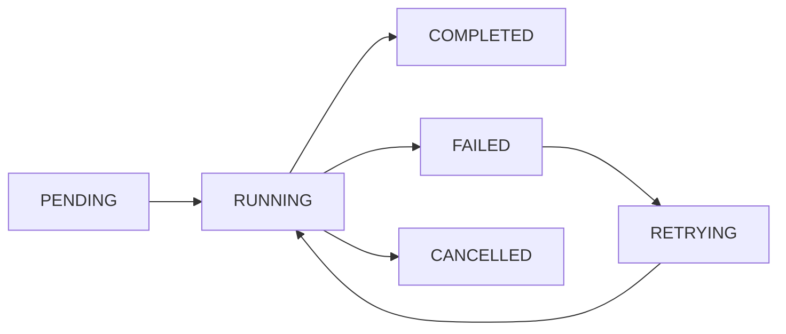

# 🧠 Core Concepts - The Building Blocks of Cleo

Welcome to the brain of Cleo! 🧩 Let's dive deep into the core concepts that make Cleo a powerhouse of task processing.

<h2 id="tasks" className="text-2xl mt-4 font-bold">🎯 Tasks: The Heart of Cleo</h2>

Tasks are the fundamental unit of work in Cleo. Think of them as little missions waiting to be accomplished! 

```typescript
// The anatomy of a task
@cleo.task({
  name: 'super-mission',
  queue: 'important-stuff',
  priority: TaskPriority.HIGH,
  retries: 3
})
async function importantTask(data: any) {
  logger.info('Starting important task', {
    fileName: 'tasks/important.ts',
    lineNo: 10,
    functionName: 'importantTask',
    variable: 'data',
    value: data
  });
  // Your mission-critical code here
}
```

### Task States


<h2 id="workers" className="text-2xl mt-3 font-bold">🎭 Workers: Your Task-Processing Army</h2>

Workers are the brave soldiers that execute your tasks. They can work alone or in groups!

```typescript
// Worker configuration
cleo.configure({
  workers: {
    concurrency: 5,        // 5 tasks at once
    maxMemory: '1GB',      // Memory limit
    gracefulShutdown: true // Polite shutdown
  }
});

// Custom worker behavior
class CustomWorker extends CleoWorker {
  async beforeProcess(task: Task) {
    logger.info('Worker starting task', {
      fileName: 'workers/custom.ts',
      lineNo: 25,
      functionName: 'beforeProcess',
      variable: 'taskId',
      value: task.id
    });
  }
}
```

<h2 id="queues" className="text-2xl mt-4 font-bold">📬 Queues: The Task Highway System</h2>

Queues are like different lanes on a highway, each serving different types of traffic.

```typescript
// Queue configuration
cleo.configure({
  queues: {
    'fast-lane': {
      maxSize: 1000,
      priority: true
    },
    'bulk-processing': {
      maxSize: 10000,
      rateLimiting: {
        maxPerSecond: 100
      }
    }
  }
});
```

### Queue Types
1. **Standard Queues**
```typescript
@cleo.task({ queue: 'default' })
async function regularTask() {
  // Normal priority processing
}
```

2. **Priority Queues**
```typescript
@cleo.task({
  queue: 'critical',
  priority: TaskPriority.CRITICAL
})
async function emergencyTask() {
  logger.info('Emergency task running', {
    fileName: 'tasks/emergency.ts',
    lineNo: 40,
    functionName: 'emergencyTask',
    variable: 'priority',
    value: 'CRITICAL'
  });
}
```

3. **Delayed Queues**
```typescript
@cleo.task({
  queue: 'scheduled',
  delay: '1h'
})
async function futureTask() {
  // Runs after 1 hour
}
```

## 🔄 Message Brokers: The Communication Backbone

Message brokers are the postal service of Cleo, ensuring reliable message delivery.

```typescript
// Redis broker configuration
cleo.configure({
  broker: {
    type: 'redis',
    url: process.env.REDIS_URL,
    options: {
      tls: true,
      maxRetriesPerRequest: 3
    }
  }
});

// Monitor broker health
async function checkBrokerHealth() {
  const health = await cleo.getBrokerHealth();
  logger.info('Broker health check', {
    fileName: 'monitoring/broker.ts',
    lineNo: 55,
    functionName: 'checkBrokerHealth',
    variable: 'status',
    value: health
  });
}
```

## 📊 Task Results & Error Handling

Understanding task outcomes and handling failures gracefully.

```typescript
// Result handling
@cleo.task({
  name: 'important-calculation'
})
async function calculateStuff(): Promise<Result> {
  try {
    const result = await performCalculation();
    logger.info('Calculation completed', {
      fileName: 'tasks/calc.ts',
      lineNo: 70,
      functionName: 'calculateStuff',
      variable: 'result',
      value: result
    });
    return result;
  } catch (error) {
    logger.error('Calculation failed', {
      fileName: 'tasks/calc.ts',
      lineNo: 80,
      functionName: 'calculateStuff',
      variable: 'error',
      value: error.message
    });
    throw error;
  }
}
```

## 🎨 Task Middleware: The Pipeline System

Middleware allows you to add custom behavior to your task processing pipeline.

```typescript
// Custom middleware
const loggingMiddleware: TaskMiddleware = {
  async beforeTask(task: Task) {
    logger.info('Task starting', {
      fileName: 'middleware/logging.ts',
      lineNo: 90,
      functionName: 'beforeTask',
      variable: 'task',
      value: {
        id: task.id,
        name: task.name
      }
    });
  },
  async afterTask(task: Task, result: any) {
    logger.info('Task completed', {
      fileName: 'middleware/logging.ts',
      lineNo: 100,
      functionName: 'afterTask',
      variable: 'result',
      value: result
    });
  }
};

// Apply middleware
cleo.use(loggingMiddleware);
```

## 🔐 Task Context & State Management

Managing task state and context throughout the processing lifecycle.

```typescript
interface TaskContext {
  userId: string;
  timestamp: Date;
  metadata: Record<string, any>;
}

@cleo.task({
  name: 'stateful-task',
  contextType: 'TaskContext'
})
async function processWithContext(data: any, context: TaskContext) {
  logger.info('Processing with context', {
    fileName: 'tasks/stateful.ts',
    lineNo: 120,
    functionName: 'processWithContext',
    variable: 'context',
    value: context
  });
  
  // Access context throughout task lifecycle
  await updateTaskState(context.userId, 'PROCESSING');
  
  // Final state update
  await updateTaskState(context.userId, 'COMPLETED');
}
```

## 🎯 Task Patterns & Best Practices

### 1. Idempotency
```typescript
@cleo.task({
  idempotencyKey: (params) => params.orderId
})
async function processOrder(params: OrderParams) {
  // Safe to retry - will only process once per orderId
}
```

### 2. Batch Processing
```typescript
@cleo.task({
  batch: {
    size: 100,
    timeout: '30s'
  }
})
async function processBatch(items: any[]) {
  logger.info('Processing batch', {
    fileName: 'tasks/batch.ts',
    lineNo: 150,
    functionName: 'processBatch',
    variable: 'batchSize',
    value: items.length
  });
}
```

### 3. Circuit Breaking
```typescript
@cleo.task({
  circuitBreaker: {
    threshold: 5,
    timeout: '1m'
  }
})
async function protectedTask() {
  // Task with circuit breaker protection
}
```

## 🎓 Advanced Concepts

### Task Composition
```typescript
const composedTask = cleo.compose([
  validateData,
  processData,
  saveResults
]);

// Execute as a single unit
await composedTask.execute(data);
```

### Custom Serialization
```typescript
@cleo.task({
  serializer: {
    serialize: (data) => encrypt(JSON.stringify(data)),
    deserialize: (data) => JSON.parse(decrypt(data))
  }
})
async function secureTask(sensitiveData: any) {
  // Data is automatically encrypted/decrypted
}
```

## 🎯 Next Steps

Ready to dive deeper? Check out:
- [Advanced Task Options](./task-options)
- [Queue Management](./queue-management)
- [Error Handling Strategies](./error-handling)
- [Monitoring & Metrics](./monitoring)

Remember: Understanding these core concepts is key to building robust task processing systems with Cleo! 🚀 