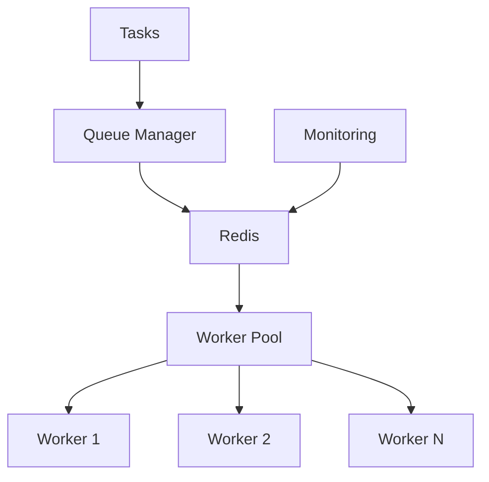

# 📈 Scaling Cleo

## Architecture Overview

Cleo is designed for horizontal scalability, leveraging Redis as its backbone for distributed task processing. Here's how different components scale:



## Worker Scaling

### Configuration

```typescript
cleo.configure({
  worker: {
    // Adjust based on CPU cores and task nature
    concurrency: 10,
    // Prevent memory leaks
    maxMemoryUsage: 1024 * 1024 * 1024, // 1GB
    // Queue-specific settings
    queues: [
      {
        name: "high-priority",
        priority: TaskPriority.HIGH,
        concurrency: 5,
        rateLimit: {
          max: 1000,
          interval: 60000 // per minute
        }
      },
      {
        name: "low-priority",
        priority: TaskPriority.LOW,
        concurrency: 2
      }
    ]
  }
});
```

### Best Practices

1. **Worker Concurrency**
   - Start with `concurrency = number of CPU cores`
   - Monitor CPU and memory usage
   - Adjust based on task types (I/O vs CPU bound)

2. **Memory Management**
   ```typescript
   cleo.configure({
     worker: {
       maxMemoryUsage: 1024 * 1024 * 512, // 512MB
       // Implement graceful shutdown
       onMemoryExceeded: async (worker) => {
         await worker.pause();
         await worker.drain();
         process.exit(0);
       }
     }
   });
   ```

3. **Queue Prioritization**
   ```typescript
   queueManager.setGroupProcessingStrategy(GroupProcessingStrategy.PRIORITY);
   await queueManager.setGroupPriority("critical-tasks", 10);
   await queueManager.setGroupPriority("background-tasks", 1);
   ```

## Redis Optimization

### Configuration

```typescript
cleo.configure({
  redis: {
    host: "redis.example.com",
    port: 6379,
    // Enable TLS for security
    tls: true,
    // Use key prefix for multi-tenant setups
    keyPrefix: "tenant1:",
    // Connection pool settings
    maxRetriesPerRequest: 3,
    enableReadyCheck: false,
    maxReconnectAttempts: 10
  }
});
```

### Best Practices

1. **Connection Management**
   - Use connection pools
   - Implement retry strategies
   - Monitor connection health

2. **Data Persistence**
   - Configure appropriate RDB/AOF settings
   - Implement backup strategies
   - Monitor Redis memory usage

3. **Multi-tenancy**
   ```typescript
   // Use key prefixes for isolation
   const tenant1 = Cleo.getInstance("tenant1");
   tenant1.configure({
     redis: {
       keyPrefix: "tenant1:",
       db: 0
     }
   });
   ```

## Monitoring & Health Checks

### Worker Metrics

```typescript
const worker = cleo.getWorker("queue-name");
const metrics = await worker.getMetrics();
console.log({
  tasksProcessed: metrics.tasksProcessed,
  tasksSucceeded: metrics.tasksSucceeded,
  tasksFailed: metrics.tasksFailed,
  averageProcessingTime: metrics.averageProcessingTime
});
```

### Group Monitoring

```typescript
const group = await queueManager.getGroup("critical-tasks");
const stats = await group.getStats();
console.log({
  total: stats.total,
  active: stats.active,
  completed: stats.completed,
  failed: stats.failed,
  paused: stats.paused
});
```

### Health Checks

```typescript
// Implement health checks
queueManager.startHealthCheck(30000); // Every 30 seconds

queueManager.on("healthCheck", async (status) => {
  if (status.redisLatency > 100) {
    await notifyAdmin("High Redis latency detected");
  }
  if (status.failedTasks > threshold) {
    await scaleWorkers(status.activeWorkers + 1);
  }
});
```

## Load Balancing

### Task Distribution

```typescript
// Implement custom routing based on load
class LoadBalancedTaskRouter {
  async route(task: Task): Promise<string> {
    const workers = await queueManager.getAllWorkers();
    const metrics = await Promise.all(
      workers.map(w => w.getMetrics())
    );
    return selectLeastLoadedWorker(workers, metrics);
  }
}
```

### Auto-scaling

```typescript
// Implement auto-scaling based on metrics
async function autoScale() {
  const metrics = await queueManager.getLatestQueueMetrics();
  if (metrics.waiting > threshold) {
    await scaleWorkers(currentWorkers + 1);
  }
  if (metrics.waiting < lowThreshold) {
    await scaleWorkers(currentWorkers - 1);
  }
}
```

## Production Checklist

- [ ] Configure appropriate worker concurrency
- [ ] Set up memory limits and monitoring
- [ ] Implement graceful shutdown procedures
- [ ] Configure Redis persistence and backups
- [ ] Set up monitoring and alerting
- [ ] Implement health checks
- [ ] Configure rate limiting for stability
- [ ] Set up load balancing
- [ ] Implement auto-scaling policies
- [ ] Monitor and optimize Redis performance 