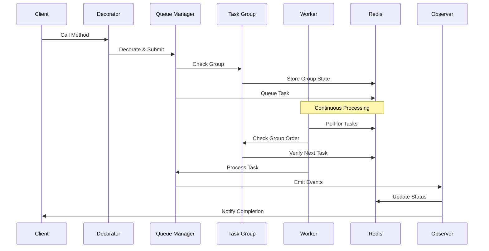
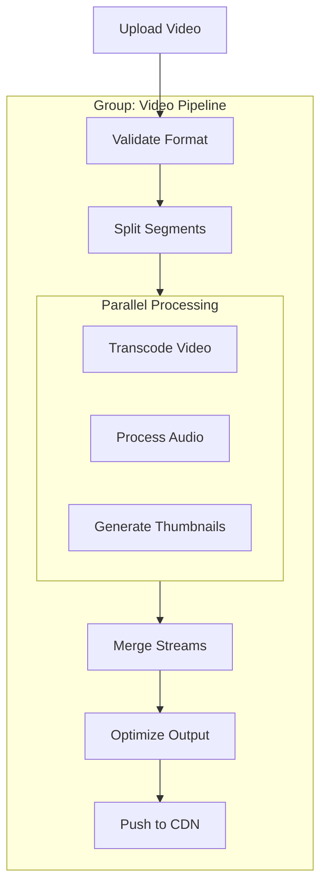
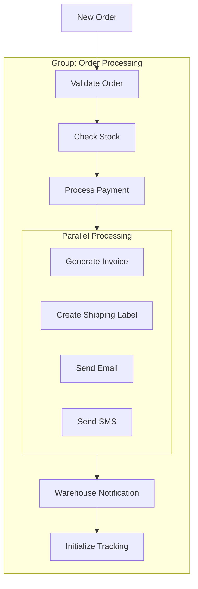
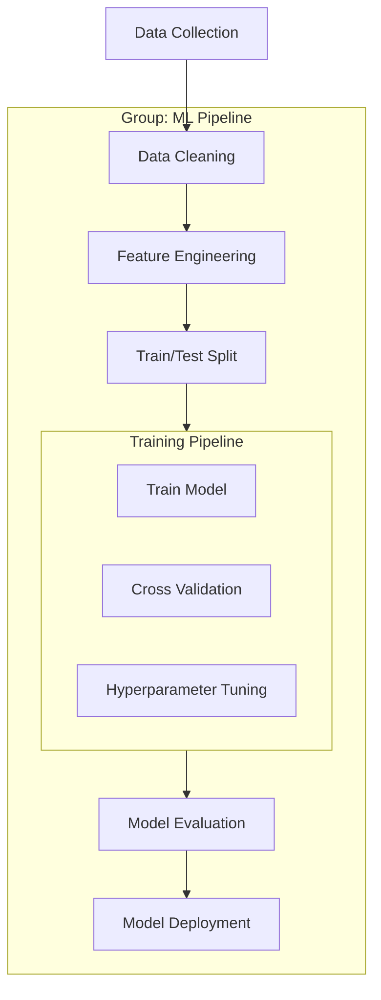
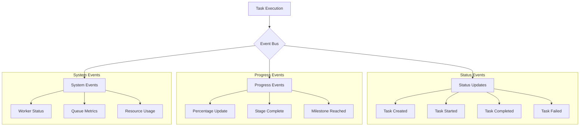

# Cleo - Advanced Task Queue Management System 🚀


Cleo is a powerful, Redis-based distributed task queue management system with advanced group processing capabilities, real-time monitoring, and sophisticated task orchestration.


> **🚧 Under Development:** Cleo is currently in active development. Features and APIs may change. Stay tuned for updates!


> **Note:** We're based on BullMQ, but with some added features and improvements. See the [BullMQ docs](https://docs.bullmq.io/) for more information but we'll cover the main differences here.

## Features 🌟

### Core Features
- 🔄 Distributed task processing with automatic load balancing
- 👥 Advanced group task management with multiple processing strategies
- 📊 Real-time task monitoring and event-driven updates
- 🎯 Priority-based processing with dynamic adjustments
- ⚡ Event-driven architecture using Redis pub/sub
- 🛡️ Built-in error handling with configurable retries
- 📈 Comprehensive task statistics and metrics

### Group Processing Strategies
- 🔄 Round Robin: Fair task distribution across groups for balanced processing
- 📝 FIFO: Sequential processing within groups for ordered execution
- ⭐ Priority: Dynamic priority-based processing with group weights

## System Architecture 🏗️

```mermaid
graph TB
    Client[Client Application] --> Decorator[Task Decorator]
    Decorator --> QM[Queue Manager]
    QM --> Redis[(Redis)]
    QM --> Worker[Worker Pool]
    QM --> Observer[Task Observer]
    QM --> Groups[Task Groups]
    Worker --> Redis
    Observer --> Redis
    Groups --> Redis
    
    subgraph "Event System"
        Observer --> Events((Event Bus))
        Events --> Monitoring[Monitoring System]
        Events --> Logging[Logging System]
        Events --> Metrics[Metrics Collection]
    end

    subgraph "Group Processing"
        Groups --> Strategy{Strategy Manager}
        Strategy --> RR[Round Robin]
        Strategy --> FIFO[FIFO]
        Strategy --> Priority[Priority]
    end

    subgraph "Worker Pool"
        Worker --> W1[Worker 1]
        Worker --> W2[Worker 2]
        Worker --> W3[Worker 3]
    end
```



## Task Processing Flow 🔄



## Real-World Use Cases 🌍

### Video Processing Pipeline 🎥


### E-commerce Order Processing 🛍️


### AI Training Pipeline 🤖


## Advanced Features 🔧

### Task Grouping Capabilities
- 🔄 **Dynamic Group Creation**
  - Auto-scaling groups
  - Group merging and splitting
  - Dynamic priority adjustment

- 📊 **Group Statistics**
  - Real-time metrics
  - Performance analytics
  - Resource utilization

- 🎯 **Processing Strategies**
  - Adaptive batch processing
  - Smart task routing
  - Load-based scaling

### Event System Architecture 🎯



## Performance Optimizations ⚡

### Redis Integration
- 📊 Efficient data structures for task storage
- 🔄 Pub/Sub for real-time event propagation
- 💾 Atomic operations for data consistency
- 🔍 Smart caching strategies

### Worker Management
- 🔄 Dynamic worker scaling
- 📈 Intelligent load balancing
- 🚦 Adaptive rate limiting
- 🎯 Resource-aware task distribution

### Group Processing
- 🎯 Predictive task batching
- 📊 Dynamic priority adjustment
- 🔄 Efficient task ordering
- ⚡ Pipeline optimization

## Security Features 🔒

### Authentication & Authorization
- 🔐 Redis ACL support
- 🛡️ Task-level permissions
- 📝 Audit logging
- 🔑 Role-based access control

### Data Protection
- 🔒 Encryption at rest
- 🔐 Secure task data handling
- 🛡️ Input validation
- 📝 Data sanitization

## Monitoring & Debugging 🔍

### Real-time Metrics
- 📊 Task success/failure rates
- ⏱️ Processing time analytics
- 🎯 Group performance metrics
- 📈 Resource utilization stats

### Logging System
- 📝 Structured logging
- 🚨 Error tracking
- 📊 Performance profiling
- 🔍 Debug information

## Installation & Setup 🛠️

Docs web app: https://cleo.theboring.name/docs

## License 📄

MIT License - see LICENSE file for details
```