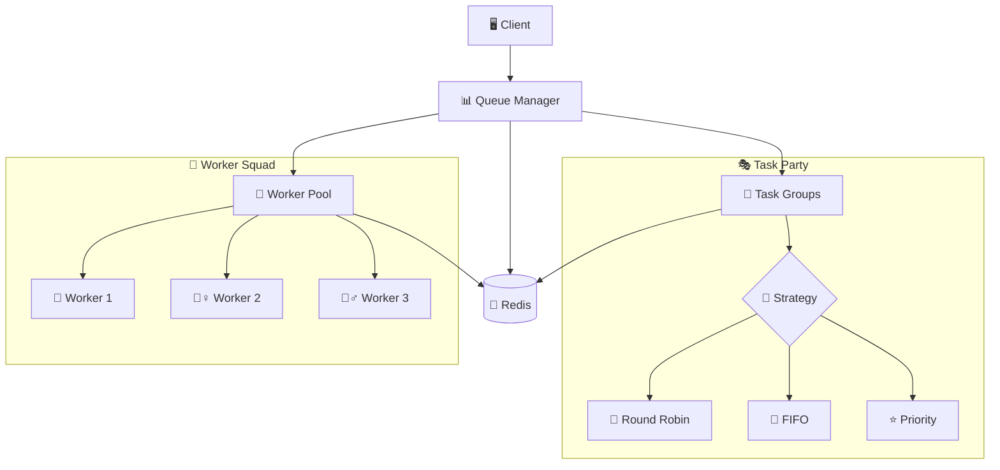
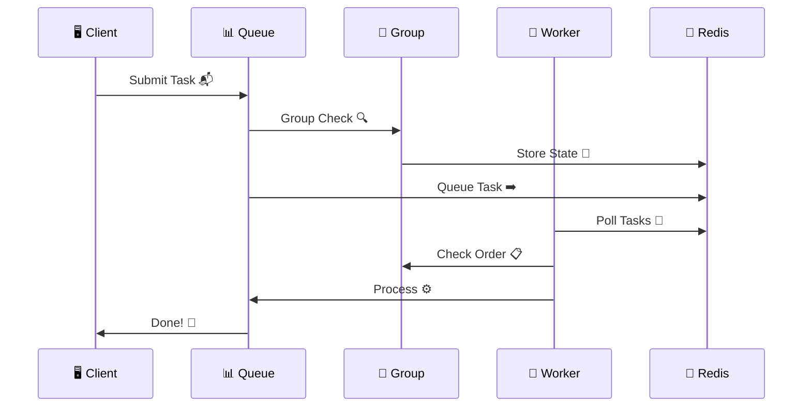
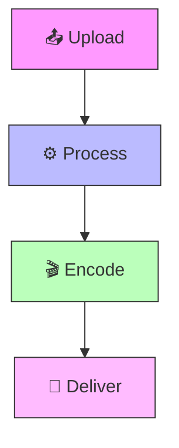
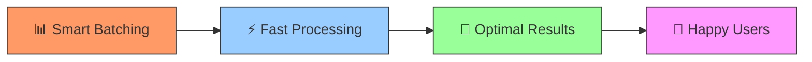

# Cleo 🚀


> Why did the task queue go to therapy? It had too many unresolved promises! 😅

A distributed task queue system that's seriously powerful (but doesn't take itself too seriously 🎭).


## Features ✨

- **Task Grouping** 🎯 - Because some tasks are more social than others
- **Distributed Locking** 🔐 - No queue jumping allowed!
- **Retry with Backoff** 🔄 - If at first you don't succeed... we got you covered
- **Redis-Backed** 📦 - Because memory is fleeting, but Redis is forever
- **TypeScript Support** 💪 - For when `any` just won't cut it

### Core Superpowers 💫

#### Task Processing 🎯
- 🚀 Distributed processing with auto load balancing
- 🎭 Group task management (for tasks that play well with others)
- 📊 Real-time monitoring (because we're all a bit nosy)
- ⭐ Priority-based processing (some tasks are just more important)
- ⚡ Event-driven architecture (Redis pub/sub magic)
- 🛡️ Built-in error handling (because stuff happens)
- 📈 Performance metrics (for the data nerds)

#### Group Processing Strategies 🎲
- 🔄 **Round Robin**: Fair play for all tasks
- 📝 **FIFO**: First in, first out (no cutting in line!)
- ⭐ **Priority**: VIP tasks get VIP treatment
- 🎯 **Dynamic**: Adapts faster than a developer during a production incident

#### Advanced Features 🔬
- 🎯 **Smart Batching**
  - Groups tasks like a pro party planner
  - Optimizes performance like a caffeine-powered compiler
  - Handles bursts better than your morning coffee machine

- 📊 **Real-time Analytics**
  - Success/failure tracking (keeping score)
  - Processing time stats (for the speed demons)
  - Resource usage metrics (watching the diet)
  - Performance insights (big brain time)

#### Security & Protection 🛡️
- 🔐 Redis ACL support (because sharing isn't always caring)
- 🎯 Task-level permissions (not everyone gets a backstage pass)
- 📝 Audit logging (tracking who did what)
- 🔑 Role-based access (VIP list management)

## System Architecture 🏗️
(Where all the magic happens ✨)



## Task Flow 🌊
(AKA: The Epic Journey of a Task)



## Real-World Examples 🌍
(Because who doesn't love practical examples?)

### Video Processing 🎥


## Quick Start 🏃‍♂️

```typescript
// The fastest way to get your tasks running
// (faster than a developer spotting a semicolon error)
import { QueueManager } from '@cleo/core';

const queue = new QueueManager();
await queue.addTask('make-coffee', { priority: 'HIGH' }); // ☕
```

## Installation 🛠️

```bash
npm install @cleo/core
# or if you're yarn-core'd
yarn add @cleo/core
```

## Contributing 🤝

We welcome contributions! Whether you're fixing bugs 🐛, adding features ✨, or improving docs 📚, we'd love your help!

> Q: How many developers does it take to review a PR?
> A: None, they're all stuck in an infinite loop of bikeshedding! 😄

Check out our [Contributing Guidelines](CONTRIBUTING.md) for:
- Code style and standards 📝
- Development workflow 🔄
- Project structure 🏗️
- Pull request process 🔍
- Bug reporting guidelines 🐞

### Key Components 🔧

Our project is like a well-oiled machine (that occasionally needs coffee):
- **QueueManager** 📊 - The traffic controller of your tasks
- **TaskGroup** 👥 - Because tasks work better in teams
- **Worker** 🏃 - The real MVP doing all the heavy lifting
- **Utilities** 🛠️ - Our Swiss Army knife of helper functions

## Performance Features ⚡
(Because speed matters!)



## License 📜

MIT License - see LICENSE file for details

> Remember: In a world of callbacks, promises, and async/await, we're all just trying our best to avoid race conditions! 🏁

---
Made with ❤️ and probably too much caffeine ☕