# Cleo 🚀


> Why did the task queue go to therapy? It had too many unresolved promises! 😅

A distributed task queue system that's seriously powerful (but doesn't take itself too seriously 🎭).


## Docs

- [Cleo Docs](https://cleo.theboring.name)
- [Task History Documentation](docs/TASK_HISTORY.md)

## Features ✨

- **Task Grouping** 🎯 - Because some tasks are more social than others
- **Distributed Locking** 🔐 - No queue jumping allowed! (Enhanced with GroupLock)
- **Retry with Backoff** 🔄 - If at first you don't succeed... we got you covered
- **Redis-Backed** 📦 - Because memory is fleeting, but Redis is forever
- **TypeScript Support** 💪 - For when `any` just won't cut it
- **Centralized Task History** 📊 - Track everything with comprehensive analytics
- **Enhanced Error Handling** 🛡️ - Robust authentication and connection management

### Core Superpowers 💫

#### Task Processing 🎯
- 🚀 Distributed processing with auto load balancing
- 🎭 Group task management (for tasks that play well with others)
- 📊 Real-time monitoring (because we're all a bit nosy)
- ⭐ Priority-based processing (some tasks are just more important)
- ⚡ Event-driven architecture (Redis pub/sub magic)
- 🛡️ Built-in error handling (because stuff happens)
- 📈 Performance metrics (for the data nerds)
- 🔒 Enhanced locking with GroupLock (prevents race conditions)

#### Task History & Analytics 📊
- 📝 **Centralized History Management**
  - Worker-specific task history
  - Task-specific tracking across workers
  - Queue-level analytics
  - Group-based monitoring
  - Global system overview

- 📈 **Rich Analytics**
  - Success/failure rates
  - Processing duration statistics
  - Performance trends over time
  - Resource utilization metrics
  - Error pattern analysis

- 🔍 **Multi-dimensional Querying**
  - Filter by worker, task, queue, or group
  - Time-based analysis
  - Performance bottleneck identification
  - Historical trend analysis

#### Group Processing Strategies 🎲
- 🔄 **Round Robin**: Fair play for all tasks
- 📝 **FIFO**: First in, first out (no cutting in line!)
- ⭐ **Priority**: VIP tasks get VIP treatment
- 🎯 **Dynamic**: Adapts faster than a developer during a production incident

#### Advanced Features 🔬
- 🎯 **Smart Batching**
  - Groups tasks like a pro party planner
  - Optimizes performance like a caffeine-powered compiler
  - Handles bursts better than your morning coffee machine

- 📊 **Real-time Analytics**
  - Success/failure tracking (keeping score)
  - Processing time stats (for the speed demons)
  - Resource usage metrics (watching the diet)
  - Performance insights (big brain time)

- 🔐 **Enhanced Security & Reliability**
  - Robust Redis authentication handling
  - Connection resilience with automatic retry
  - Comprehensive error logging and recovery
  - Race condition prevention with GroupLock

#### Security & Protection 🛡️
- 🔐 Redis ACL support (because sharing isn't always caring)
- 🎯 Task-level permissions (not everyone gets a backstage pass)
- 📝 Audit logging (tracking who did what)
- 🔑 Role-based access (VIP list management)
- 🛡️ Enhanced authentication error handling
- 🔒 Distributed locking with GroupLock for safe concurrent operations

## System Architecture 🏗️
(Where all the magic happens ✨)

```mermaid
graph TB
    Client[🖥️ Client] --> QM[📊 Queue Manager]
    QM --> Redis[(💾 Redis)]
    QM --> Worker[👷 Worker Pool]
    QM --> Groups[👥 Task Groups]
    QM --> History[📊 Task History Service]
    Worker --> Redis
    Groups --> Redis
    Groups --> Lock[🔒 GroupLock]
    History --> Redis
    
    subgraph "🎭 Task Party"
        Groups --> Strategy{🎯 Strategy}
        Strategy --> RR[🔄 Round Robin]
        Strategy --> FIFO[📝 FIFO]
        Strategy --> Priority[⭐ Priority]
    end

    subgraph "💪 Worker Squad"
        Worker --> W1[🏃 Worker 1]
        Worker --> W2[🏃‍♀️ Worker 2]
        Worker --> W3[🏃‍♂️ Worker 3]
    end

    subgraph "📊 Analytics Hub"
        History --> WH[👷 Worker History]
        History --> TH[📋 Task History]
        History --> QH[🎯 Queue History]
        History --> GH[👥 Group History]
        History --> GL[🌍 Global History]
    end
```



## Task Flow 🌊
(AKA: The Epic Journey of a Task)

```mermaid
sequenceDiagram
    participant C as 🖥️ Client
    participant QM as 📊 Queue
    participant G as 👥 Group
    participant L as 🔒 GroupLock
    participant W as 👷 Worker
    participant H as 📊 History
    participant R as 💾 Redis

    C->>QM: Submit Task 📬
    QM->>G: Group Check 🔍
    G->>L: Acquire Lock 🔒
    L-->>G: Lock Granted ✅
    G->>R: Store State 💾
    QM->>R: Queue Task ➡️
    W->>R: Poll Tasks 🎣
    W->>G: Check Order 📋
    W->>QM: Process ⚙️
    W->>H: Log History 📝
    H->>R: Store Analytics 📊
    G->>L: Release Lock 🔓
    QM->>C: Done! 🎉
```



## Real-World Examples 🌍
(Because who doesn't love practical examples?)

### Video Processing 🎥

```mermaid
graph TB
    Upload[📤 Upload] --> Process[⚙️ Process]
    Process --> Encode[🎬 Encode]
    Encode --> Deliver[🚀 Deliver]
    
    style Upload fill:#f9f,stroke:#333
    style Process fill:#bbf,stroke:#333
    style Encode fill:#bfb,stroke:#333
    style Deliver fill:#fbf,stroke:#333
```



## Installation 🛠️

```bash
npm install @cleo/core
# or if you're yarn-core'd
yarn add @cleo/core
```

## Quick Start 🏃‍♂️

## Examples 🎮
(Because the best way to learn is by doing!)

### Quick Start 🚀
```typescript
import { Cleo } from '@cleo/core';

// Get your Cleo instance (it's like a task-managing pet)
const cleo = Cleo.getInstance();

// Configure it (give it treats and training)
cleo.configure({
  redis: {
    host: "localhost",
    port: 6379,
    password: "cleosecret", // Enhanced auth handling!
  },
  worker: {
    concurrency: 4,
    queues: [
      {
        name: "send-email",
        priority: TaskPriority.HIGH,
      },
    ],
  },
});

// Monitor your tasks (helicopter parenting, but for code)
const queueManager = cleo.getQueueManager();
queueManager.onTaskEvent(ObserverEvent.STATUS_CHANGE, (taskId, status, data) => {
  console.log(`Task ${taskId} status changed to ${status}`, data);
});
```

### Task Decorators 🎀
```typescript
import { task } from "@cleo/core";

class EmailService {
  @task({
    id: "send-email",
    priority: TaskPriority.HIGH,
    queue: 'send-email',
  })
  async sendEmail(input: { email: string }): Promise<string> {
    // Your email sending logic here
    return `Sent to ${input.email}`;
  }
}
```

### Advanced Group Processing 🎭
```typescript
import { QueueClass, GroupProcessingStrategy } from "@cleo/core";

// Define a service with group settings
@QueueClass({
  defaultOptions: {
    maxRetries: 3,
    retryDelay: 1000,
    backoff: {
      type: "fixed",
      delay: 2000,
    },
    group: "notifications",
    timeout: 300000,
  },
  queue: "notifications",
})
class NotificationService {
  async sendPushNotification(data: { message: string }) {
    console.log(`📱 Sending push: ${data.message}`);
    return `Notification sent: ${data.message}`;
  }

  async sendSMS(data: { message: string }) {
    console.log(`📲 Sending SMS: ${data.message}`);
    return `SMS sent: ${data.message}`;
  }
}

// Use different processing strategies
const queueManager = cleo.getQueueManager();

// Round Robin (taking turns like a proper queue)
queueManager.setGroupProcessingStrategy(GroupProcessingStrategy.ROUND_ROBIN);

// FIFO (first in, first out, just like a coffee shop)
queueManager.setGroupProcessingStrategy(GroupProcessingStrategy.FIFO);

// Priority (VIP treatment for important tasks)
queueManager.setGroupProcessingStrategy(GroupProcessingStrategy.PRIORITY);
await queueManager.setGroupPriority("notifications", 10);
```

### Task History & Analytics 📊
```typescript
import { TaskHistoryService } from "@cleo/core";

// Get the task history service
const historyService = TaskHistoryService.getInstance();

// Get worker-specific history
const workerHistory = await historyService.getWorkerHistory("worker-123", 50);

// Get task-specific history across all workers
const taskHistory = await historyService.getTaskHistory("task-456", 25);

// Get queue analytics
const queueHistory = await historyService.getQueueHistory("email-queue", 100);

// Get group performance
const groupHistory = await historyService.getGroupHistory("notifications", 75);

// Get global system stats
const globalHistory = await historyService.getGlobalHistory(200);
const stats = await historyService.getHistoryStats();

console.log("System Performance:", {
  totalTasks: stats.totalTasks,
  successRate: (stats.completedTasks / stats.totalTasks) * 100,
  averageDuration: stats.averageDuration,
  failureRate: (stats.failedTasks / stats.totalTasks) * 100,
});
```

### Error Handling & Retries 🛟
```typescript
// Built-in retry configuration with enhanced error handling
@QueueClass({
  defaultOptions: {
    maxRetries: 3,
    backoff: {
      type: "fixed",
      delay: 2000,
    },
    retryDelay: 1000,
  }
})
class ReliableService {
  async mightFail() {
    // Will retry 3 times with backoff
    // Enhanced error logging and history tracking
    throw new Error("Oops!");
  }
}

// Manual retry with backoff
import { RetryWithBackoff } from "@cleo/core";

const result = await retryWithBackoff(
  async () => {
    return await unreliableOperation();
  },
  3,    // max retries
  1000  // base delay in ms
);
```

### Event Monitoring 📊
```typescript
const queueManager = cleo.getQueueManager();

// Monitor all the things!
queueManager.onTaskEvent(ObserverEvent.STATUS_CHANGE, (taskId, status, data) => {
  console.log(`💬 Task ${taskId} status: ${status}`);
});

queueManager.onTaskEvent(ObserverEvent.GROUP_CHANGE, (taskId, status, data) => {
  console.log(`👥 Group operation: ${data.operation}`);
});

queueManager.onTaskEvent(ObserverEvent.TASK_COMPLETED, (taskId, status, result) => {
  console.log(`✅ Task ${taskId} completed:`, result);
});

queueManager.onTaskEvent(ObserverEvent.TASK_FAILED, (taskId, status, error) => {
  console.log(`❌ Task ${taskId} failed:`, error);
});
```

### Complete Examples 📚

Check out our example files for full implementations:
- [Basic Usage](packages/core/examples/basic.ts) - Simple task processing with monitoring
- [Advanced Features](packages/core/examples/advanced.ts) - Group processing, strategies, and error handling
- [Task History Examples](examples/taskHistoryExample.ts) - Comprehensive analytics and monitoring

Each example comes with:
- 🎯 Complete setup and configuration
- 📊 Event monitoring setup
- 🎭 Different processing strategies
- 🛠️ Error handling patterns
- 📈 Performance monitoring
- 📊 Task history and analytics

## New Features & Improvements 🆕

### Enhanced Task History System 📊
- **Centralized Management**: Single `TaskHistoryService` for all history operations
- **Multi-dimensional Storage**: Track by worker, task, queue, group, and globally
- **Automatic Cleanup**: Built-in expiration and list trimming to prevent memory bloat
- **Rich Analytics**: Comprehensive statistics and performance metrics
- **Easy Integration**: Seamless integration with existing Worker and QueueManager classes

### Improved Group Locking 🔒
- **GroupLock Integration**: Replaced simple Redis locking with robust `GroupLock` implementation
- **Race Condition Prevention**: Safe concurrent operations across distributed workers
- **Enhanced Error Handling**: Comprehensive logging and error recovery
- **Lock Management**: Automatic cleanup and timeout handling

### Better Error Handling 🛡️
- **Redis Authentication**: Enhanced handling of `NOAUTH` and `WRONGPASS` errors
- **Connection Resilience**: Automatic retry and recovery mechanisms
- **Comprehensive Logging**: Detailed error tracking and debugging information
- **Graceful Degradation**: System continues operating even with partial failures

## Contributing 🤝

We welcome contributions! Whether you're fixing bugs 🐛, adding features ✨, or improving docs 📚, we'd love your help!

> Q: How many developers does it take to review a PR?
> A: None, they're all stuck in an infinite loop of bikeshedding! 😄

Check out our [Contributing Guidelines](CONTRIBUTING.md) for:
- Code style and standards 📝
- Development workflow 🔄
- Project structure 🏗️
- Pull request process 🔍
- Bug reporting guidelines 🐞

### Key Components 🔧

Our project is like a well-oiled machine (that occasionally needs coffee):
- **QueueManager** 📊 - The traffic controller of your tasks
- **TaskGroup** 👥 - Because tasks work better in teams (now with GroupLock!)
- **Worker** 🏃 - The real MVP doing all the heavy lifting
- **TaskHistoryService** 📊 - Your analytics powerhouse
- **GroupLock** 🔒 - Keeping your concurrent operations safe
- **Utilities** 🛠️ - Our Swiss Army knife of helper functions

## Performance Features ⚡
(Because speed matters!)

```mermaid
graph LR
    A[📊 Smart Batching] --> B[⚡ Fast Processing]
    B --> C[🎯 Optimal Results]
    C --> D[🎉 Happy Users]
    E[🔒 GroupLock] --> F[🛡️ Safe Concurrency]
    F --> G[📈 Reliable Performance]
    H[📊 Task History] --> I[🔍 Deep Insights]
    I --> J[⚡ Performance Optimization]
    
    style A fill:#f96,stroke:#333
    style B fill:#9cf,stroke:#333
    style C fill:#9f9,stroke:#333
    style D fill:#f9f,stroke:#333
    style E fill:#ff9,stroke:#333
    style F fill:#9ff,stroke:#333
    style G fill:#f9f,stroke:#333
    style H fill:#9f9,stroke:#333
    style I fill:#ff9,stroke:#333
    style J fill:#9cf,stroke:#333
```



## Documentation 📚

- [Task History Service](docs/TASK_HISTORY.md) - Comprehensive analytics and monitoring
- [Group Processing](docs/GROUP_PROCESSING.md) - Advanced task grouping strategies
- [Error Handling](docs/ERROR_HANDLING.md) - Robust error management
- [Performance Tuning](docs/PERFORMANCE.md) - Optimization best practices

## License 📜

MIT License - see LICENSE file for details

> Remember: In a world of callbacks, promises, and async/await, we're all just trying our best to avoid race conditions! 🏁 (Good thing we have GroupLock now! 🔒)

---
Made with ❤️ and probably too much caffeine ☕

*Now with 100% more task history and 0% more race conditions!* 🎉